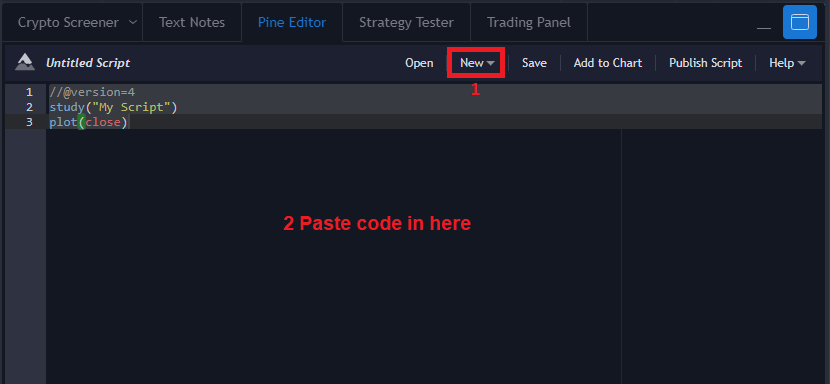
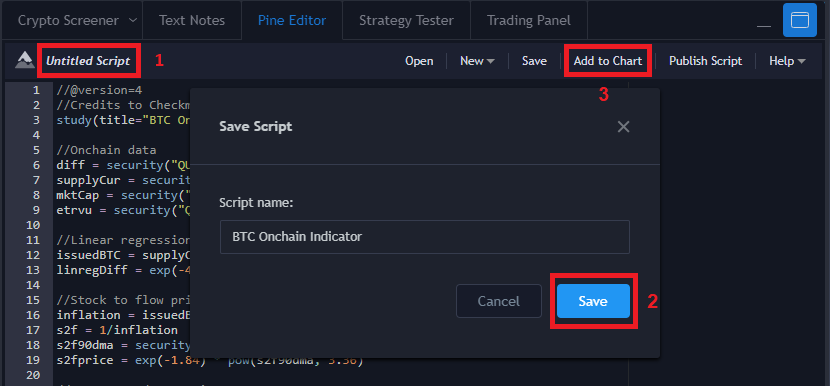

# BTC Onchain Indicator
This BTC Onchain Indicator uses onchain data to provide different Pricing Models for trend determination.

## Features

- Linear Regression of Difficulty
- Stock to Flow Price
- Average and Top Price
- 128 and 200 DMA

Credits to Checkmate for providing the formulas for calculation.

## Add Script to Tradingview Chart

1. Go into Pine Editor and click **New**
2. Paste [code](scripts/BTC_Onchain.txt)
 into editor area

3. Click **Untitled Script** and enter name
4. Click **Save**
5. Click **Add to Chart**

